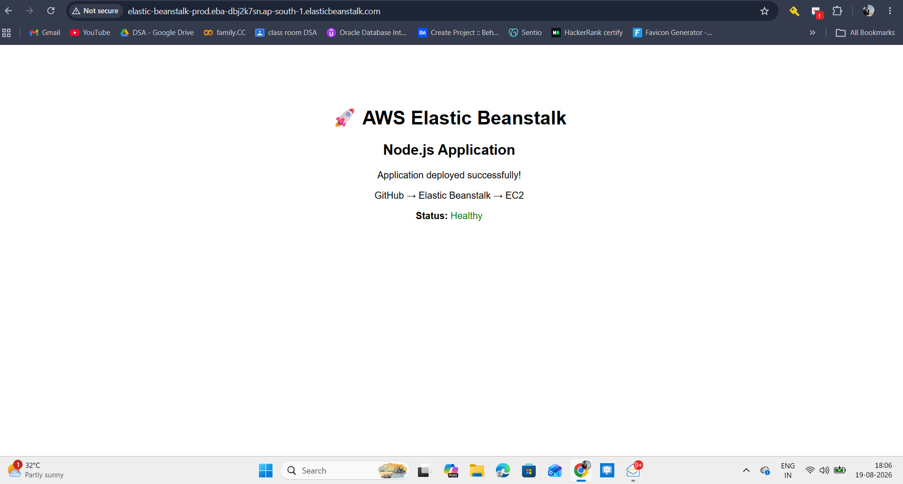

# elastic-beanstalk-nodejs

Node.js application deployed on AWS Elastic Beanstalk.

## Application

- `GET /` serves the application page.
- `GET /health` returns the application health status.
- The server listens on `process.env.PORT`, with `8080` as the local default.

## Run Locally

```bash
npm install
npm start
```

Open `http://localhost:8080` or check `http://localhost:8080/health`.

## Deploy to Elastic Beanstalk

The environment uses Node.js 22 in `ap-south-1`. The VPC configuration is stored in `.ebextensions/01-network.config` and explicitly uses two public subnets in different Availability Zones. This avoids Elastic Load Balancing and Auto Scaling errors caused by missing or invalid default subnets.

```bash
git add app.js package.json package-lock.json .ebextensions/01-network.config README.md
eb use elastic-beanstalk-prod
eb deploy elastic-beanstalk-prod --staged
```

For a new environment, use the verified VPC and subnet settings:

```bash
eb create elastic-beanstalk-prod \
	--region ap-south-1 \
	--platform "Node.js 22 running on 64bit Amazon Linux 2023" \
	--instance_type t3.micro \
	--elb-type application \
	--vpc \
	--vpc.id vpc-07df4ede9dedfc58c \
	--vpc.ec2subnets subnet-034543d4846b54d71,subnet-06d15206779ad14f5 \
	--vpc.elbsubnets subnet-034543d4846b54d71,subnet-06d15206779ad14f5 \
	--vpc.securitygroups sg-0555ce4ccbbf70a0d \
	--vpc.elbpublic \
	--vpc.publicip
```

## Deployed URL

- Application: http://elastic-beanstalk-prod.eba-dbj2k7sn.ap-south-1.elasticbeanstalk.com/
- Health check: http://elastic-beanstalk-prod.eba-dbj2k7sn.ap-south-1.elasticbeanstalk.com/health

Deployment report:

- Environment: `elastic-beanstalk-prod`
- Region: `ap-south-1`
- Platform: Node.js 22 on 64-bit Amazon Linux 2023
- Status: `Ready`
- Health: `Green`
- Health check: `200 OK`


